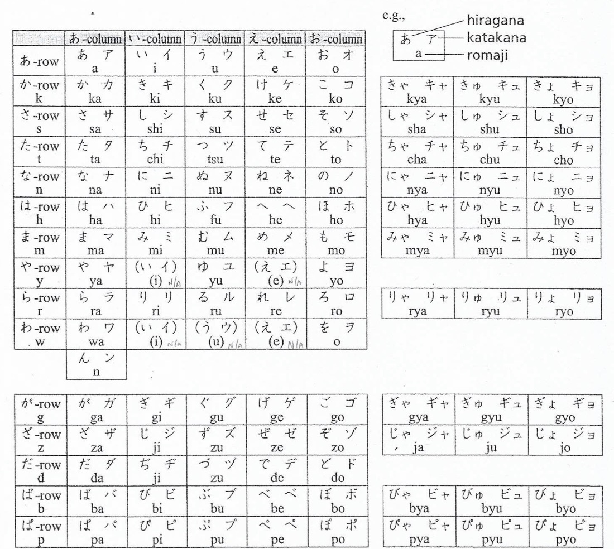

# Characters

Two types:

- Kanji
- Kana
  Kana is made up of:
- Hiragana
- Katakana

## Kana

For writing phonetic Japanese. There are 46 basic sounds that are based on 5 vowels combined with 9 consonants (k,s,t,n,h,m,y,r,w). Not all consonants go with all vowels.

k, s, t, h are 'voiceless' because they do not make a strong sound they go to:

k -> g
s -> z
t -> d
h -> b

which combined with vowels make more sounds. This is Dakuten

b -> p

This is the handakuten.

### Semi Vowels

Ya, yu, yo. Combined with the consonants.

[Guide for learning Hiragana](https://www.tofugu.com/japanese/learn-hiragana/)

## Kanji

Uses Chinese characters that have become part of the Japanese writing system
